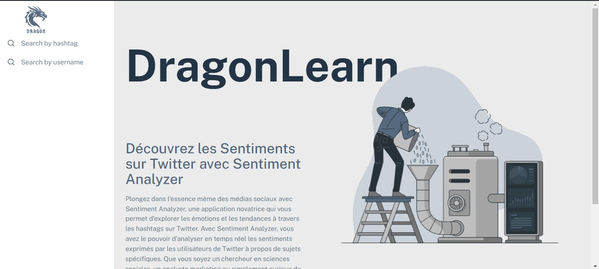
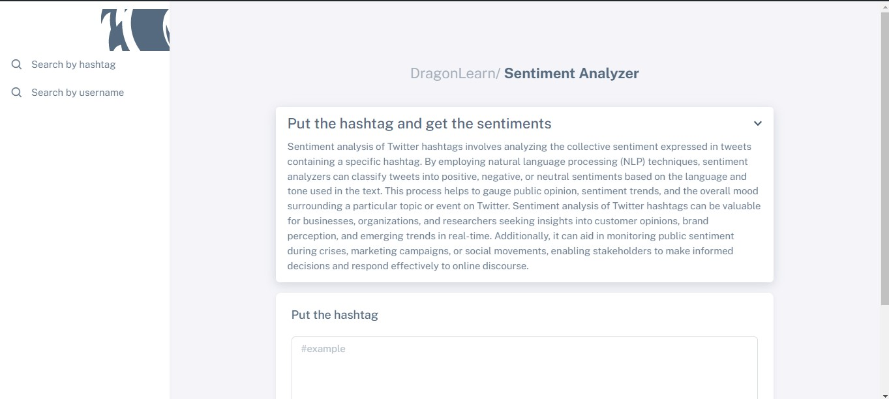
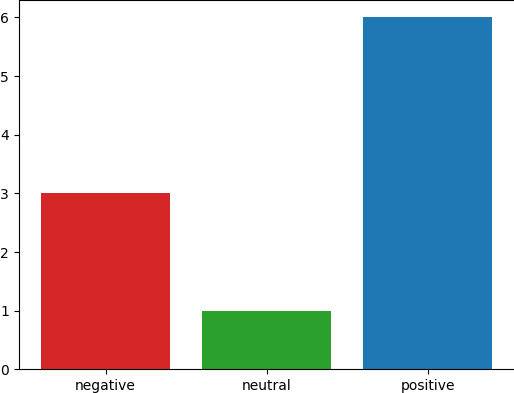
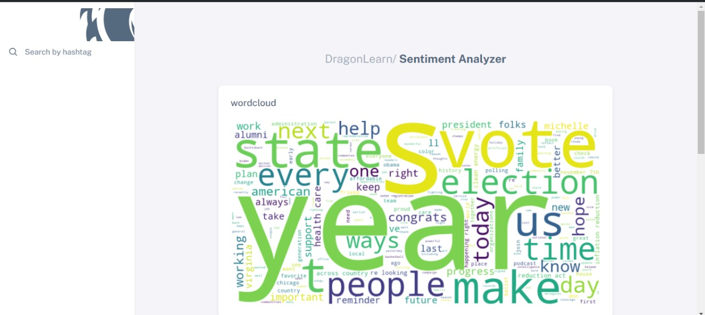

## Mise en place :

### Page d'accueil:

La page d'accueil de mon projet est conçue pour fournir une présentation claire et concise du projet, permettant à l'utilisateur de comprendre rapidement son objectif et ses fonctionnalités principales. L'interface utilisateur de la page d'accueil comprend un design intuitif avec un sidebar permettant de naviguer facilement vers d'autres sections pertinentes du projet, notamment la page d'implémentation des hashtags.

### Page d'insertion de hashtag:

Cette page constitue la section où l'utilisateur peut insérer le hashtag pour initier le processus de traitement.

Après la saisie d'un hashtag, le processus de collecte de données démarre. Il comprend la connexion à Twitter et le scraping des tweets pertinents. Une fois terminé, les résultats sont présentés sous forme de deux éléments visuels :

- Un nuage de mots : Il met en évidence les mots les plus fréquemment utilisés dans les tweets collectés, permettant d'identifier les thèmes et tendances dominants.
- Un histogramme : Il illustre la répartition des sentiments exprimés dans les tweets, en affichant le pourcentage de tweets positifs, négatifs et neutres.

En guise d'illustration, considérons le hashtag #obama.

### Histogramme :

### Word Cloud :

En plus d'avoir réalisé le scraping et la visualisation basés sur les noms d'utilisateur, j'ai également exploré la recherche par hashtag.
